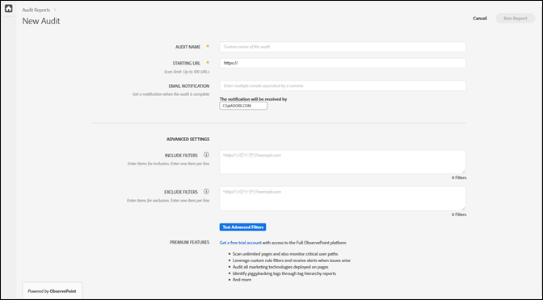

# Create a new audit{#create-a-new-audit}

>[!NOTE]
>
>使用者只能一次執行一次審核。 如果您嘗試使用與正在運行的審計相同的設定啟動審計時，將發生錯誤。 如果要取消當前正在運行的審計，可以使用錯誤消息中的連結，以便建立新的審計。

視需要，使用頁面底部的連結，透過ObservePoint存取免費且功能完整的試用帳戶。

1. 從「審計者」清單中，按一下「 **[!UICONTROL 新建審計」]**。

   The [!DNL New Audit] screen opens.

   

1. （必要）為稽核命名。

   名稱的長度最多可為 250 個字元。
1. （必要）指定開始的URL。

   指定起始URL時，需要協定。 起始URL是稽核開始編目的頁面。 啟動後，Auditor會依循從開始URL開始的連結，編目多達500個頁面。 如需詳 [細資訊，請參閱包含](../create-audit/filters.md#concept-23531490bb124981ba807ed1806e3257) 和排除篩選。 起始URL最多可有250個字元。

   >[!NOTE]
   >
   >在某些情況下，完成500頁掃描可能需要48小時。

1. 指定一或多個電子郵件地址，以取得有關此稽核的通知。

   您可以使用逗號分隔每個地址，以指定多封電子郵件。 預設會通知要求者。 電子郵件地址會即時驗證。 如果您輸入無效的位址，螢幕會通知您。

   每封電子郵件的字元數限制不超過250個，包括網域結尾（例如。com）。
1. 指定「包含篩選」。

   此欄位可包含精確的URL、部分URL或規則運算式。 請使用此欄位來建立您要每個URL符合的條件。 任何不符合「包含篩選條件」的編目URL都不會包含在稽核結果中。

   您可以輸入希望審計掃描的目錄。 或者，您可以執行跨網域或自我反向連結稽核，您需要在一個網域上開始稽核，然後在另一個網域上結束稽核。 若要這麼做，請輸入您要遍歷的網域；對於複雜的URL模式，請使用規則運算式。

   >[!NOTE]
   >
   >如果您的篩選器中包含頁面，但該頁面未連線至您的起始URL，或Auditor在到達該頁面前掃描了500頁，則不會掃描該頁面，也不會包含在測試結果中。

   包含篩選限制為每行1,000個字元。

   如需詳 [細資訊，請參閱](../create-audit/filters.md#section-7626060a56a24b658f8c05f031ac3f5f) 「包含清單」。
1. 指定排除篩選。

   「排除清單」會防止URL被稽核。 使用精確的URL、部分URL或規則運算式，就像在「包含清單」中一樣。

   一個常見做法是，如果審計具有用戶會話，則排除註銷連結(例如： `/logout`表示包含字串的任何URL `/logout`)。

   排除篩選限制為每行1,000個字元。

   如需詳 [細資訊](../create-audit/filters.md#section-00aa5e10c878473b91ba0844bebe7ca9) ，請參閱排除清單。
1. （可選）如有需要，您可以測試包含和排除篩選器，並測試您的URL。

   輸入篩選器和URL，然後按一 **[!UICONTROL 下「套用]** 」以執行測試。

   

1. 按一下&#x200B;**[!UICONTROL 「執行報表」]**。
